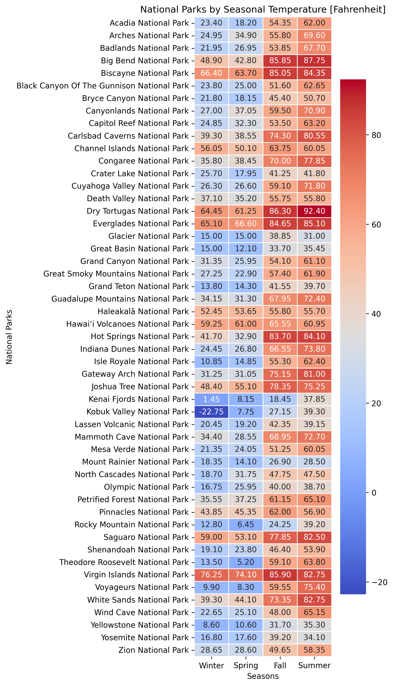

# Exploring the Great Outdoors: Weather and Activities Across US National Parks
Melisa Morales, Victoria Scott, and Stephanie Souza (Team Three)

# Wild Wonders: Unveiling US National Park Data

This project involves creating ETL (Extract, Transform, Load) workflows to ingest and transform data from the National Park Service (NPS) API and Open-Meteo Weather API before storing it in a database. A chosen database, MongoDB, houses the data, comprising at least two tables or collections. The project documentation includes the rationale for the database selection and detailed documentation of the ETL workflow, supported by diagrams or an ERD.

Our powerpoint presentation can be found at "NPS ETL Team Project 3.pptx"

## Park Pursuits: Exploring Activities, Amenities, and Weather

Our National Parks Finder app is a web-based application designed to help users discover national parks based on their desired amenities and activities. Built with a Flask backend and a MongoDB database, the app provides an interactive map that displays parks matching the user's preferences. Users can filter parks by selecting from a variety of amenities and activities, and choose the season they are interested in. The app dynamically updates the map to show relevant parks, providing detailed information about each one. This tool is perfect for planning trips and exploring the best that national parks have to offer.

## Chasing Sunshine: Finding the Perfect Weather for Your National Park Adventure

A heatmap plot of seasonal temperatures across US national parks can be an invaluable tool for both researchers and park visitors. By visually representing temperature variations throughout the year, the heatmap allows users to easily identify the best times to visit specific parks based on their weather preferences. For instance, those looking to avoid extreme heat can quickly pinpoint cooler seasons, while others seeking warmer conditions can identify peak times for their ideal weather. Additionally, this visualization can assist park management and conservationists in understanding climate patterns and their impact on park ecosystems, aiding in the development of strategies to protect and preserve these natural environments. Overall, a heatmap of seasonal temperatures serves as a comprehensive, user-friendly guide for making informed decisions about park visits and understanding broader climate trends.

# Ethical Considerations

When extracting amenities, activities, and weather data for US national parks, significant efforts were made to ensure ethical considerations were addressed throughout the process. Team Three ensured data accuracy and integrity by cross-referencing information from multiple reliable sources to avoid the propagation of misinformation. Transparency was maintained by clearly documenting the data sources, transformation processes, and any limitations or biases inherent in the data. These steps were essential to ensure the ethical use of data, safeguarding the interests of both the data providers and the end users who rely on this information for planning their visits to national parks.

# References
## Dataset: 
National Park Service (API)
https://www.nps.gov/subjects/developer/api-documentation.htm

Open-Meteo Weather (API)
https://open-meteo.com/

## Team Gitlab
https://github.com/melmelmorales/ETL_Project
